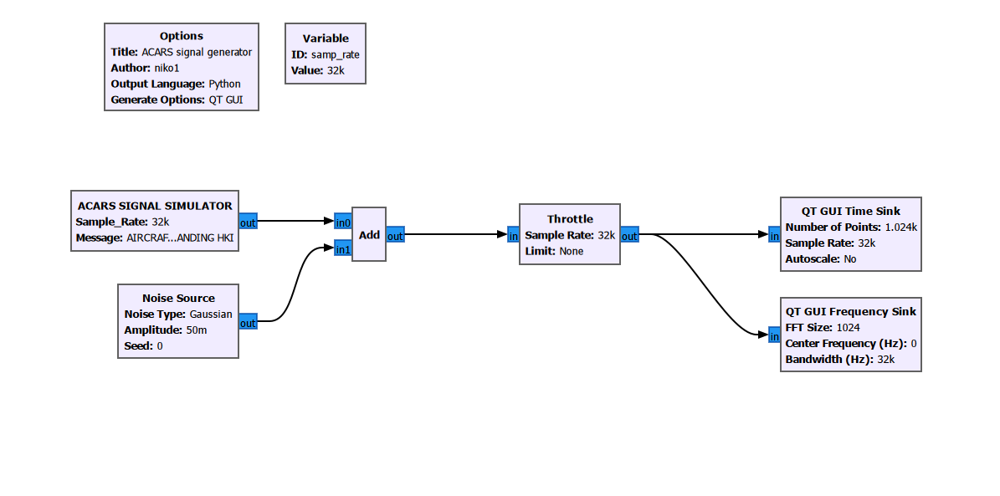
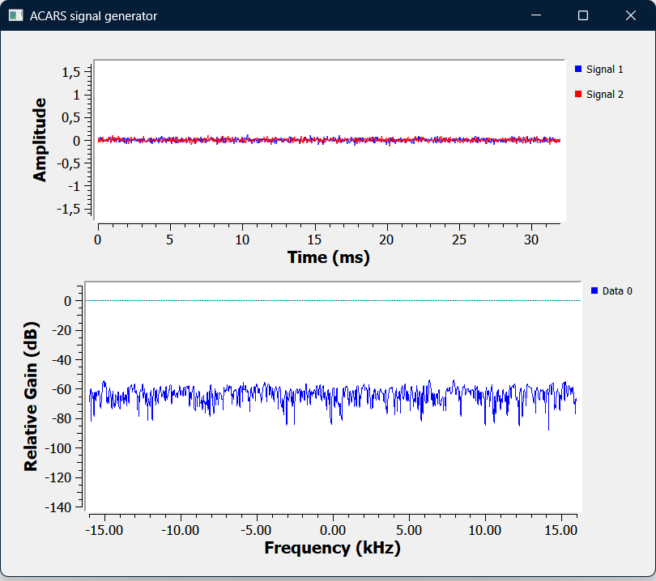
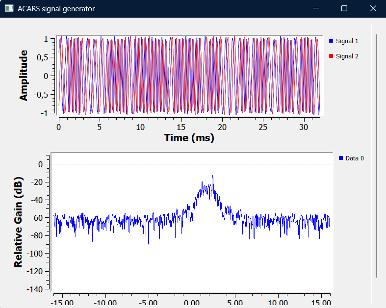
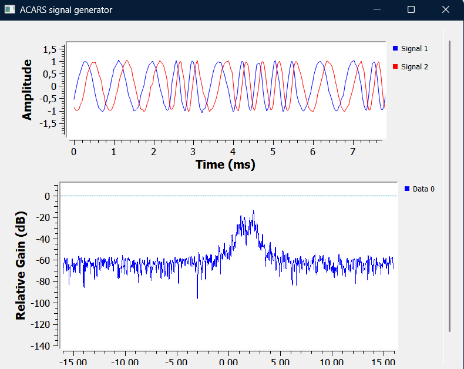

# Overview
This is my aggregate repo for custom gnu-radio blocks and adjacent things. It's a learning project but it can be used by anyone.

## quickstart
> **Note:** requires gnu-radio

```
# python setup
# insert a python module to the flowchart and paste the custom_modules/py/acars_sig_source.py to the editor

# cpp setup LINUX
mkdir gr-custom_modules/build
cd gr-custom_modules/build
cmake ..
make
sudo make install
sudo ldconfig
```

## modules
+ ACARS signal source
    + transmits the prekey signal + message payload common in air-traffic communication
    
## demo
<figure>
  
  <figcaption><i>Figure 1: Example GNU Radio flowchart for the ACARS generator.</i></figcaption>
</figure>

<table>
  <tr>
    <td align="center">
      <br>
      <b>Gaussian noise</b>
    </td>
    <td align="center">
      <br>
      <b>ACARS Signal Burst</b>
    </td>
    <td align="center">
      <br>
      <b>Zoomed</b>
    </td>
  </tr>
</table>
